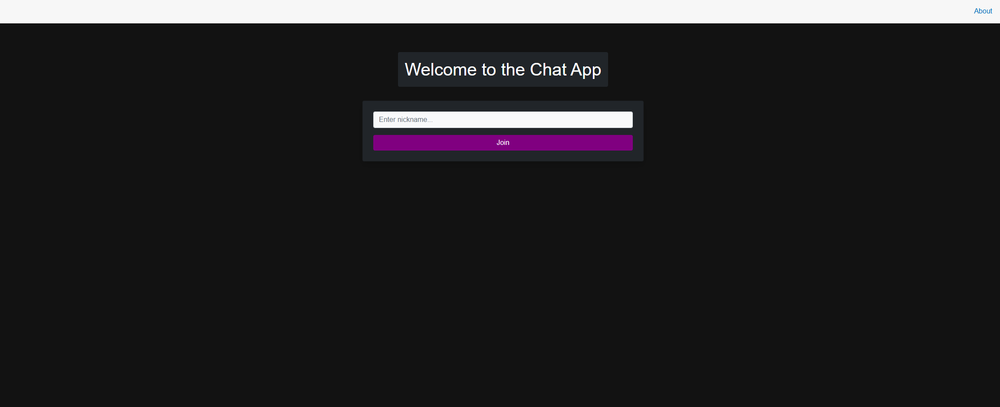
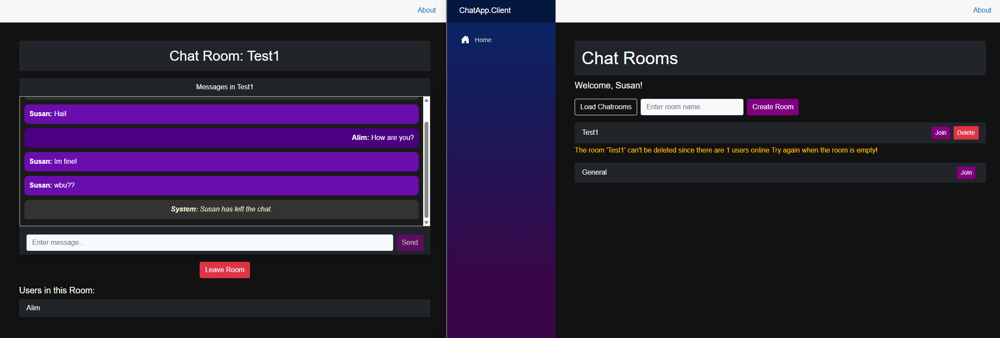
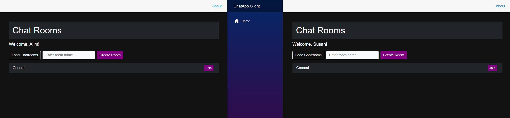
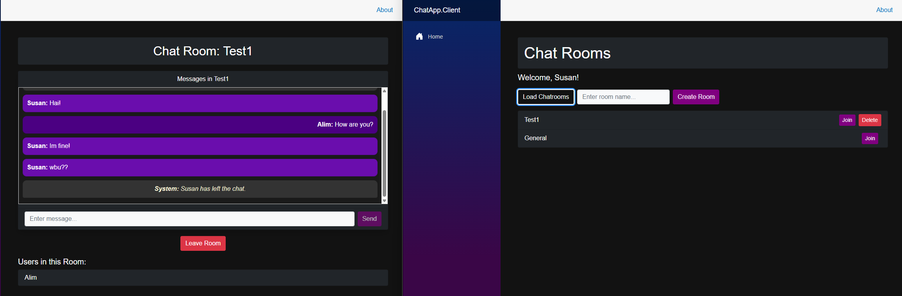

# Real-Time Chat Application using SignalR

A web-based real-time chat application built with Blazor and SignalR. The application fulfills all specified requirements for a multi-room chat system with unique nicknames and real-time communication.

---

## Project Requirements

This project meets the following criteria:

- Users can interact with the chat via a web frontend (Blazor).
- Users must enter a nickname when accessing the application.
- Nicknames are unique; duplicate names are not allowed.
- A list of chatrooms is displayed after login.
- At least one default chatroom named "General" is always available.
- Users can create and delete chatrooms.
- Chatrooms can only be deleted if they are empty.
- Upon entering a chatroom, users begin receiving messages from that moment on.
- Messages sent before entering a room are not displayed.
- Users can see the nicknames of other users currently in the same room.
- Messages are broadcasted to all users in the room.
- Each message displays the sender’s nickname.
- No polling is used – real-time updates are handled with SignalR.

---

## Features

- Real-time communication with SignalR
- Unique nickname handling
- Multiple chatroom support
- Controlled chatroom deletion
- Room-specific user lists
- In-room messaging and presence awareness
- Responsive layout

---

## Preview Gallery 
[*View all preview images in the Assets folder*](./Assets/)

### Login Page

### Chatroom Overview

### Create New Room

### Room Deletion Blocked (not empty)

### Room Successfully Deleted

### Chatroom with Messages

### SignalR Real-Time Messages

### Unique Nickname Enforcement

### User Left the Room

---

Created with ❤️ by [Bunnii](mailto:bxnniibu@gmail.com)  
Let me build something awesome for you!
